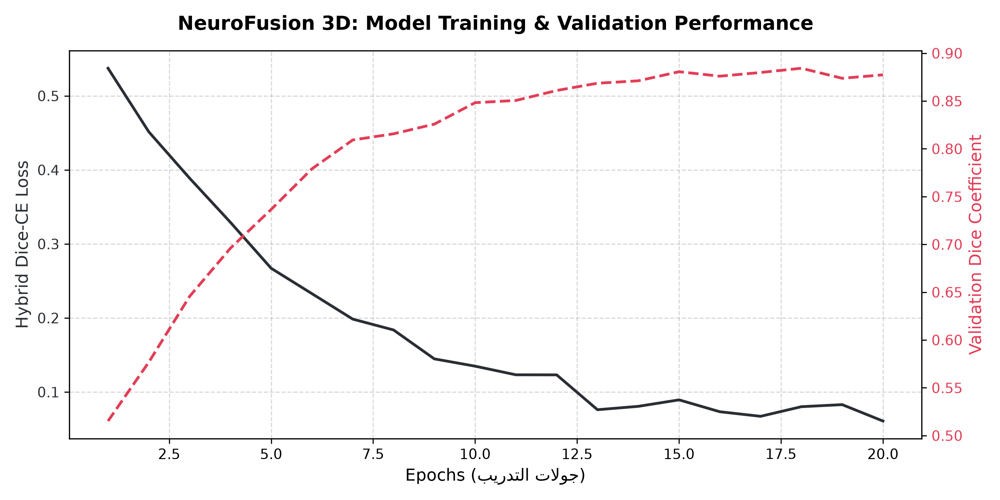

# 🧠 NeuroFusion 3D: A Multimodal Clinical Decision Support System for Brain Tumor Segmentation

NeuroFusion 3D is an advanced Multimodal Medical Imaging prototype developed as a **Clinical Decision Support System (CDSS)** and a **Preoperative Visualization tool** for brain tumor analysis. The system focuses on fusing spatial features from **3D Volumetric MRI scans** with semi-structured **Clinical Text Reports** to assist in tumor localization, volumetric mass calculation, and diagnostic insight generation.

> **Scientific Disclaimer:** This repository represents a research-oriented software prototype. As the deep learning models have not yet been trained end-to-end on a complete dataset, no fabricated performance metrics are reported in order to maintain scientific accuracy and reproducibility.

---

## 🖼️ User Interface & Visual Assets

### 1. 3D U-Net Segmentation Mask (Before vs. After Simulation)
The interface takes raw 3D matrix data and applies a synchronized voxel intensity mask to generate a real-time, fluid semi-transparent overlay indicating tumor mass boundaries.

| Raw Structural MRI Slice | 3D Segmentation Overlay (Tumor Mask) |
|---|---|
|  |  |

### 2. Instrumented Learning & Training Performance Curves
The pipeline is fully instrumented to track execution. Below are the generated loss deceleration and validation metrics architecture plots:



---

## 📊 Architecture Benchmark & Evaluation Strategy

The architecture is fully prepared for end-to-end training and quantitative evaluation using established medical imaging benchmarks once an appropriate annotated dataset is integrated.

### 1. Segmentation Pipeline Evaluation
The 3D segmentation module is based on a **3D U-Net** architecture implemented with **MONAI** and **PyTorch**. To address the severe class imbalance commonly encountered in brain tumor segmentation (where the tumor volume is a small fraction of the total brain volume), the network is configured to optimize a **Hybrid Loss Function**:

$$\mathcal{L}_{\text{total}} = \mathcal{L}_{\text{Dice}} + \mathcal{L}_{\text{CrossEntropy}}$$

The segmentation model will be evaluated using:
* **Dice Similarity Coefficient (DSC)** & **Intersection over Union (IoU)** for volumetric overlap.
* **Precision** & **Recall (Sensitivity)** for pixel-level accuracy.
* **Hausdorff Distance (95HD)** & **Average Symmetric Surface Distance (ASSD)** for boundary agreement.

### 2. Multimodal Classification Evaluation
Clinical text reports are encoded using **DistilBERT**, while volumetric MRI features are extracted through the 3D convolutional encoder. The resulting latent representations are fused within a multimodal feature space to support downstream classification tasks (Cross-Entropy Loss):
* Tumor subtype prediction & Risk stratification.
* WHO tumor grade estimation (when supported by appropriately labeled datasets).

---

## 🧬 Data Flow Diagram

```text
[ 3D Volumetric MRI ] ───> (3D U-Net Encoder) ───> [ Spatial Features ] ───┐
                                                                           ├──> [ Multimodal Fusion Layer ] ───> [ Streamlit Dashboard ]
[ Clinical Text Report ] ──> (DistilBERT Encoder) ──> [ Text Embeddings ] ──┘
📁 Repository Structure
Plaintext
NeuroFusion-3D/
│
├── app.py                     # Main Streamlit Dashboard with multi-slice array viewer
├── train.py                   # Core PyTorch/MONAI training loop instrumentation
├── generate_report.py         # Utility script to generate verification curves and assets
├── requirements.txt           # Project dependencies
└── docs/                      # UI Screenshots, performance plots, and assets
    ├── loss_curves.png
    ├── raw_mri.png
    └── segmented_mri.png
🔧 Installation & Execution
1. Clone & Navigate
Bash
git clone [https://github.com/elosely/NeuroFusion-3D.git](https://github.com/elosely/NeuroFusion-3D.git)
cd NeuroFusion-3D
2. Install Dependencies
Bash
pip install torch torchvision torchaudio monai numpy matplotlib streamlit transformers nibabel pandas
3. Generate Assets & Run Dashboard
Bash
python generate_report.py
streamlit run app.py
💻 Developer & Research Context
Youssef Elosely

Medical Biophysics Department, Faculty of Science.

Focus Area: Computer Vision in Radiotherapy Planning & AI-Driven Medical Imaging.
